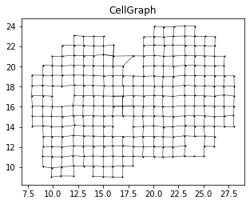
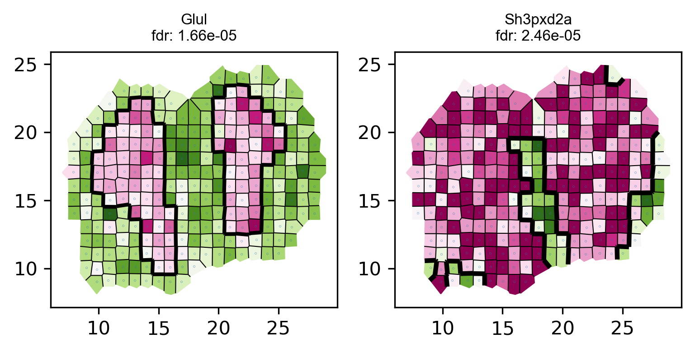
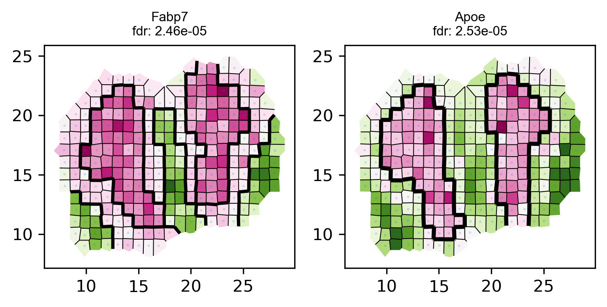
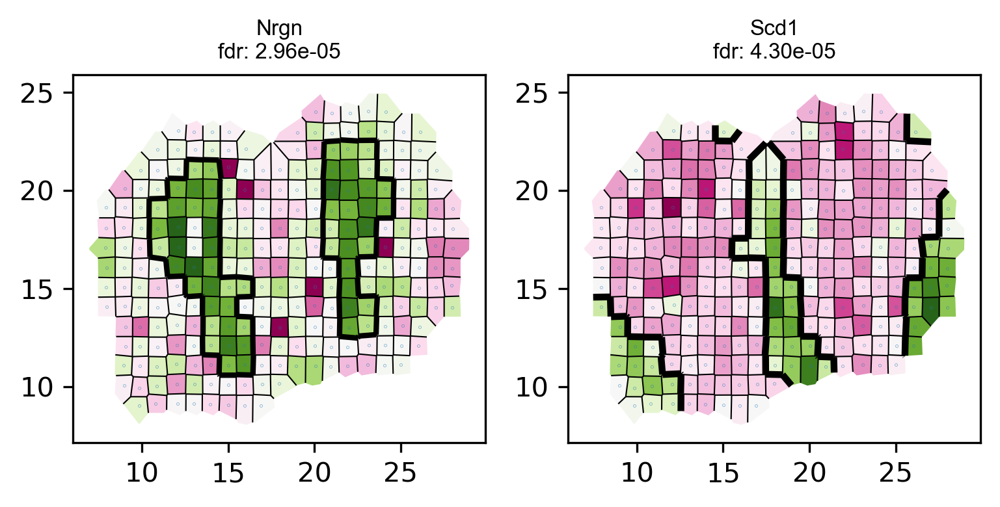
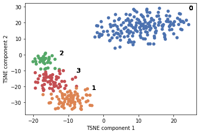
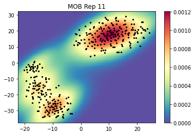
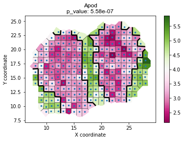

## Single-cell Graph Cuts Optimization   

## **(scGCO)**

### Overview

**scGCO** is a method to identify genes demonstrating position-dependent differential expression patterns, also known as spatially viable genes, using the powerful graph cuts algorithm. ScGCO can analyze spatial transcriptomics data generated by diverse technologies, including but not limited to single-cell RNA-sequencing, or *in situ* FISH based methods.What's more, scGCO can easy scale to millions of cells.

### Repo Contents

This repository contains source codes of scGCO, and tutorials on running the program.


### Installation Guide

The primary implementation is as a Python 3 package, and can be installed from the command line by

```python
 pip install scgco
```

**scGCO** has been tested on Ubuntu Linux (18.04.1), Mac OS X (10.14.1) and Windows(Windows 7 Professional).

### License
MIT Licence, see LICENSE file.


###  Authors
See AUTHORS file.

### Contact
For bugs, feedback or help please contact Peng Wang <wangpeng@picb.ac.cn>.

## Example usage of scGCO

The following codes demonstrate the typical data analysis flow of scGCO.

The tutorial has also been provided as a Jupyter Notebook in the **Tutorial** directory ([scGCO_tutorial.ipynb](/code/Tutorial/scGCO_tutorial.ipynb))

The entire process should only take 1-2 minutes on a typical desktop computer with 8 cores.

### Input Format
The required matrix format is the ST data format, a matrix of counts where spot coordinates are row names and the gene names are column names. This default matrix format (*.TSV* ) is split by tab.


As an example, let’s analyze spatially variable gene expression in Mouse Olfactory Bulb using a data set published in [Ståhl et al 2016](http://science.sciencemag.org/content/353/6294/78). 

### Identify spatial genes with scGCO


```python

from scGCO import *
import pandas as pd
import numpy as np
import matplotlib
import matplotlib.pyplot as plt
%matplotlib inline
```


```python
import warnings
warnings.filterwarnings('ignore')
```

## Tutorial with Rep11 of MOB 
### This is a step-by-step instruction on running the main functionalities of scGCO.
* <font size=4><mark>Step 1-5:</mark> perform genome-scale identification of spatially variably genes. </font>
* <font size=4><mark>Step 6-7:</mark> visualize and save identified spatial variably genes.</font>
* <font size=4><mark>Step 8:</mark> perform graph cuts on a single genes to visualize its spatial patterns.</font>


## **Step 1:**

### **Read in raw data and perform standard normalization.**


```python
j=11
unary_scale_factor=100
label_cost=10
algorithm='expansion'
ff = 'README_file/Rep'+str(j)+'_MOB_count_matrix-1.tsv'
locs,data=read_spatial_expression(ff,sep='\t',num_exp_genes=0.01, num_exp_spots=0.05, min_expression=1)

data_norm = normalize_count_cellranger(data)
print('Rep{}_processing: {}'.format(j,data_norm.shape))
```

    raw data dim: (262, 16218)
    Rep11_processing: (259, 12522)
    

## **Step 2:**  

### Create complete undiected graph with connecting spatial spots/cells 


```python
exp= data_norm.iloc[:,0]
cellGraph= create_graph_with_weight(locs, exp)
```


```python
fig, ax= plt.subplots(1,1,figsize=(5,5)) #, dpi=300)
ax.set_aspect('equal')

exp= data_norm.iloc[:,0].values
cellGraph = create_graph_with_weight(locs, exp)
ax.scatter(locs[:,0], locs[:,1], s=1, color='black')
for i in np.arange(cellGraph.shape[0]):
    x = (locs[int(cellGraph[i,0]), 0], locs[int(cellGraph[i,1]), 0]) 
    y = (locs[int(cellGraph[i,0]), 1], locs[int(cellGraph[i,1]), 1])     
    ax.plot(x, y, color='black', linewidth=0.5)
    
plt.title('CellGraph')
```


    Text(0.5, 1.0, 'CellGraph')




<br><font size=3> Both Mouse olfactor bulb and Breast cancer data sets used in the analysis have missing spots, creating holes in the grid. We recomment the users to fill the missing spot, and impute the missing values using <mark><font color=red> **AddPoints_XY_and_update_data**</font></mark> function, for more accurate analysis results. <font>  


```python
locs_new,data_norm_new,newPoints=AddPoints_XY_and_update_data(locs,data_norm,cellGraph,axis=1)
print('Filled {} points'.format(len(newPoints)))
print('After filled points: ', data_norm_new.shape)
```

    Filled 6 points
    After filled points:  (265, 12522)
    


```python
fig, ax= plt.subplots(1,1,figsize=(5,5)) #, dpi=300)
ax.set_aspect('equal')

exp_new = data_norm_new.iloc[:,0].values
cellGraph_new = create_graph_with_weight(locs_new, exp_new)
ax.scatter(locs_new[:,0], locs_new[:,1], s=1, color='black')
for i in np.arange(cellGraph_new.shape[0]):
    x = (locs_new[int(cellGraph_new[i,0]), 0], locs_new[int(cellGraph_new[i,1]), 0]) 
    y = (locs_new[int(cellGraph_new[i,0]), 1], locs_new[int(cellGraph_new[i,1]), 1])     
    ax.plot(x, y, color='black', linewidth=0.5)
    
plt.title('New CellGraph')
```


    Text(0.5, 1.0, 'New CellGraph')


## **Step3:**
### Gene expression classification via Gaussian mixture modeling


```python
t0=time.time()
gmmDict= multiGMM(data_norm_new)
print('GMM time(s): ', time.time()-t0)
```

    100%|████████████████████████████████████████████████████████████████████████████████████| 8/8 [01:13<00:00,  9.15s/it]
    

    GMM time(s):  74.15773129463196
    


```python
# store_gmm(gmmDict,fileName='')
```

## **Step 4:**  


### **Run the main scGCO function to identify genes with a non-random spatial variability**


```python

t0= time.time()
result_df= identify_spatial_genes(locs_new, data_norm_new, 
                                               cellGraph_new ,gmmDict)
print('Running time: {} seconds'.format(time.time()-t0))

```

    100%|████████████████████████████████████████████████████████████████████████████████████| 8/8 [01:51<00:00, 13.97s/it]
    

    Running time: 112.93512773513794 seconds
    

<br><font size=3>The results of scGCO can be saved to .csv files using  <mark><font color=red>**write_result_to_csv**</font></mark> function.

And the saved .csv file can be accessed using <mark><font color=red>**read_result_to_dataframe**</font></mark> function.  <font>


```python
write_result_to_csv(result_df,'../../results/MouseOB/scGCO_results/Rep{}_results_df'.format(j))
```


```python
result_df=read_result_to_dataframe('../../results/MouseOB/scGCO_results/Rep11_result_df.csv')
print(result_df.shape)
```

    (12522, 269)
    

## **Step 5:**   

### **Select genes with significant spatial non-random patterns using a specific fdr cutoff.** 

* <font size=4>default: 0.05 <br> 
select genes demonstrating significant spatial variability</font>


```python
fdr_cutoff=0.05
fdr_df=result_df.sort_values('fdr').loc[result_df.fdr<fdr_cutoff,]

print(fdr_df.shape)
```

    (333, 269)
    


```python

```


```python

```

## **Step 6:**   

<br><font size=4> **Visualize some identified genes.**</font>


```python
# visualize top genes
visualize_spatial_genes(fdr_df.iloc[0:10,], locs_new, data_norm_new ,point_size=0.2)

```











```python
# save top genes to pdf
multipage_pdf_visualize_spatial_genes(fdr_df.iloc[0:10,], locs_new, data_norm_new,point_size=0) #, 
#                                       fileName='../../results//top10_genes.pdf')
```

## **Step 7:** 
<br><font size=4> **Perform t-SNE and visualize the clustering of identified genes.**<font>


```python
marker_genes = ['Pcp4','Apod','Slc17a7','Glul']
tsne_proj_df = spatial_pca_tsne_kmeans_cluster_gene(data_norm_new, 
                                                    fdr_df.index,
                                                    marker_genes, 
                                                    perplexity = 30,
                                                    fileName=None)
# plot_tsne(tsne_proj_df.iloc[:,0:2].values,tsne_proj_df.iloc[:,2]) #,
#           fileName='../../PDF_file/supple_figure/Fig2b.pdf')
```





```python

fig,ax = plt.subplots()

zz=visualize_tsne_density(tsne_proj_df.iloc[:,0:2].values,title=title,bins=200,threshold=0.1,ax=ax,fig=fig)
```





```python

```


```python

```

## **Step 8:** 

<br><font size=4>**Perform graph cuts for a single gene.**<font>


```python
# You can also analyze one gene of interest

geneID='Apod' # Lets use Nrgn as an example
unary_scale_factor = 100 # scale factor for unary energy, default value works well
label_cost=10
algorithm='expansion'
# set smooth factor to 20 for example; 
# use bigger smooth_factor to get less segments
# use small smooth_factor to get more segments
smooth_factor=20 

ff = '../../data/Raw_data/MOB-breast_cancer/Rep11_MOB_count_matrix-1.tsv' 
# read in spatial gene expression data
locs, data = read_spatial_expression(ff,sep='\t')

# normalize gene expression
data_norm = normalize_count_cellranger(data)

# select anyone gene's expression
exp =  data_norm.iloc[:,0]

# create graph representation of spatial coordinates of cells
cellGraph = create_graph_with_weight(locs, exp)

## Fill spots
locs_new,data_norm_new,newPoints=AddPoints_XY_and_update_data(locs,data_norm,cellGraph,axis=1)

# recreate new cellGraph after filled sopts.
exp_new =  data_norm_new.iloc[:,0]
cellGraph_new = create_graph_with_weight(locs_new, exp_new)

        
# GMM 
count = data_norm_new.loc[:,geneID].values
gmm=perform_gmm(count)

# do graph cut
temp_factor=smooth_factor
newLabels = cut_graph_general(cellGraph_new, count, gmm, unary_scale_factor, 
                                           temp_factor, label_cost, algorithm)
# calculate p values
p, node, com = compute_p_CSR(locs_new, newLabels, gmm, count, cellGraph_new)

# Visualize graph cut results
plot_voronoi_boundary(geneID, locs_new, count,  newLabels, min(p)) 

```

    raw data dim: (262, 16218)
    





## Reproducibility

### The container file system

```
/ [root]
├── code
│   ├── scGCO_code
|         ├── scGCO # the source code folder for running scGCO
|   ├── analysis
|   |        ├── FIG2_a_b_c_d.ipynb:this notebook will reproduce main figure2a_2b_2c_2d
|   |        ├── FIG2_e_f.ipynb:this notebook will reproduce main figure2e_2f
|   |        ├── Simulation
|   |               ├── notebooks : this folder contains simulation scripts and runing scripts
|   |               ├── processed_data : this folder contains sim_mob sample info, tissue mat and simulation counts
|   |               ├── compare : this notebook will reproduce Suppl Figure6
|   |                    └── gen_Supple_Fig1.ipynb : this notebook will reproduce Suppl Figure1
|   |        ├── MouseOB
|   |               ├── Supple_Fig3_tsne_Genes_cluster_MOB.ipynb : this notebook will reproduce Suppl Figure3
|   |               ├── Supple_Fig4-markGenes-Rep9.ipynb : this notebook will reprodece Suppl Figure4
|   |               ├── Supple_Fig8-Tissue_structure.ipynb : this notebook will reproduce Suppl Figure8
|   |                    └── ...
|   |        ├── Breast_Cancer
|   |               ├── Supple_Fig12-Breast cancer.ipynb : this notebook will reproduce Figure2_e_f and Suppl Figure12
|   |        ├── MERFISH
|   |               ├── Supple_Fig15-MERFISH.ipynb : this notebook will reprodece Suppl Figure15
│   ├── Computation-Performance
|         ├── Fig2g_Compare_memory_simulation_data.ipynb # this notebook is for comparing occpuied memory of three three methods and shown in main fig2g
|         ├── Fig2h_Compare_time_simulation_data.ipynb # this notebook is for comparing running speed of three three methods and shown in main fig2h
|   |     ├── Simulate_script
|                   ├── create_performance_bigdata_R.ipynb # the code is for millions simulate data
|                   ├── scGCO_performance_run.ipynb # the code is for testing scGCO running speed and occupied CPU memory with simulate data

|                   ├── SPARK_performance_run.R # the code is for testing SPARK running speed and occupied CPU memory with simulate data
|                   ├── spatialDE_simulate_script.ipynb # the code is for testing spatialDE running speed and occupied CPU memory with simulate data
│   ├── README.md
|
├── data
|   ├── HighVariableGenes
|           ├── [Rep11_MOB seruat results  Tepe_MOB_hvg]
|   ├── MOB_DESeq2_results
|           ├── [Rep11 clustering 5 Layers and DESeq2 results]
|   ├── Performance_BigData
|           ├── [1M_cells_100genes_counts]
|   ├── HighVariableGenes
|           ├── [All datasets seruat results]
|   ├── Raw_data
|           ├── [All datasets counts data and HE image]
└── results
|    ├── Figure 
|    |        ├── Figure2.pdf # Figures that were output by execution of the notebook
|    |        ├── Suppl_Fig2.pdf
|    |        └── ...
|    ├── MouseOB # Notebooks that have been pre-compiled with nbconvert
|    ├── BreastCancer
|    └── ...
└── Temp_files
|    |        ├── Rep11_scGCO_tsne_proj_df # DataFrame that were used in execution of the notebook
|    |        ├── data_norm_new 
|    |               └── ...
|    |        └── tissue_mat
|    |               └── ...

```

Several Jupyter Notebooks are provided in the **analysis** directory to reproduce figures of the paper. 


### Computation Performance with small and large data sets

Several Jupyter Notebooks are provided in the **Computation-Performance**  directory to reproduce the running time simulation results reported in the main text.


### Generate memroy profiling plot (Fig. 2g)
* [Compare_memory_simulation_data.ipynb](/code/Simulation/Fig2g_Compare_memory_simulation_data.ipynb):
This notebook generates Fig. 2g using precomputed data.

### Generate running time profiling plot (Fig. 2h)
* [Compare_time_simulation_data.ipynb](/code/Simulation/Fig2h_Compare_time_simulation_data.ipynb):
This notebook generates Fig. 2h using precomputed data.

